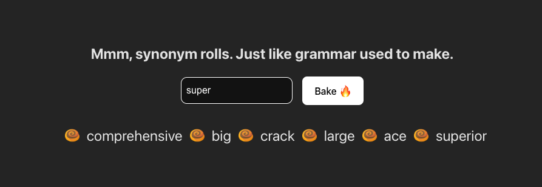

# synonym-rolls

This project is just a fun way of displaying the results of a fetch to Datamuse API to get back 6 synonyms from the entered word.

### Demo
Enter a word in the search bar and press enter/click the submit button. See the results as 6 synonyms returned by the API.

### Install
Simply open your terminal up to the root of the project and run `yarn install`.

### Run
After installation, run `yarn start ` and open the browser to the localhost address displayed.